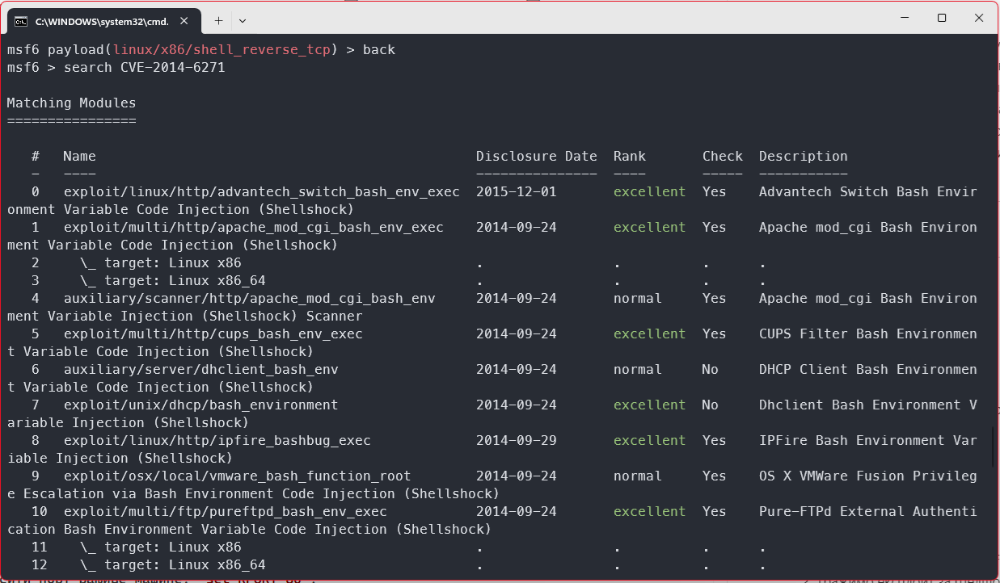
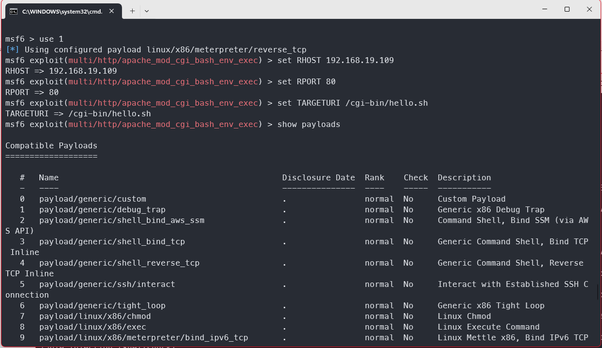
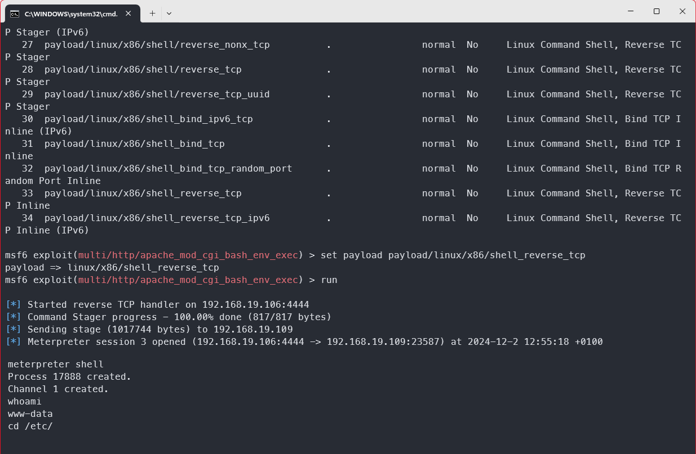

# Eksploatacija ranjivosti, detekcija, i Incident Response izveštaj

### Име и презиме: _тимски_
### Датум: 2.12.2024.

---

## Преглед рањивости

### 1.1 Информације о рањивости

- ID рањивости (CVE): CVE-2014-6271
- Погођен сервис: Bash
- CVSS оцена: 9.8
- Опис рањивости: Шел функције у Bash-у се могу експортовати кроз environment променљиву. Други bash процеси могу да "импортују" ту функцију у свој шел кроз environment променљиву. Могуће је поставити вредност те променљиве тако да се код након дефиниције прве фунцкије изврши аутоматски.

### 1.2 Опис експлоита

**Извор експлоита:**

https://github.com/rapid7/metasploit-framework/blob/master//modules/exploits/multi/http/apache_mod_cgi_bash_env_exec.rb

**Метод експлоатације:**

Упућује се захтев ка Apache Httpd-у. `HTTP_USER_AGENT` се поставља на малициозну bash команду. Уз захтев се шаље случајна вредност за маркер. Ако сервер врати тај маркер, значи да је експлоит успешно извршен. Напада се CGI јер је то део Apache-а који покреће скрипте и омогућава динамичност. Када се те скрипте позову, у шел се прикупе environment варијабле, и због рањивости ће се извршити код. У овом случају, добијамо reverse shell.

---

## Процес експлоатације

### 2.1 Подешавање експлоита

**Рањив циљ:**

- Metasploitable 3 Ubuntu
- Bash 4.3 или мање
- Apache 2.4.7 који ради на порту 80.

**Алати за експлоатацију:**

Metasploit Framework

### 2.2 Кораци експлоатације

1. Прво се покреће Metasploit Framework: `msfconsole.bat`.
2. Тражимо експлоит за Шелшок: `search CVE-2014-6271`.
3. Од понуђених, бирамо ону са индексом 1 јер она злоупотребљава Apache: `use 1`.
4. Морамо подесити адресу рањиве машине: `set RHOST 192.168.19.109`.
5. Морамо подесити порт рањиве машине: `set RPORT 80`.
6. Морамо подесити локацију ресурса који се напада (URI): `set TARGETURI /cgi-bin/hello.sh`. 
7. Морамо одабрати payload. То су подаци које ће metasploit слати када буде извршавао експлоит. `show payloads`.
8. Ми желимо да добијемо reverse shell. `set payload 33`.
9. Покрећемо експлоит `run`. 


### 2.3 Резултат експлоатације







## Детекција коришћењем Wazuh SIEM-а

### 3.1 Wazuh SIEM правила

**Правила коришћена за детекцију:**

У `/var/ossec/etc/rules/local_rules.xml` је додато следеће правило:

```xml
<group name="shellshockgroup">
    <rule id="100002" level="10">
        <description>Shellshock attack</description>
        <field>.*\(\)\s*{\s*:;.*|.*bin/bash.*</field>
        <options>no_full_log</options>
        <mitre>
            <id>T1203</id>
        </mitre>
    </rule>
</group>
```

- ID je `100002` а Mitre ID je T1203
- Level је `10`
- Опис правила: Тражи се регекс за `() { :; };`. Ако је он игде пронађен, покренуће се alert за задато правило. Не желимо да цео алерт иде у лог и зато је постављено `no_full_log`.

### 3.2 Конфигурација SIEM-а

**Подешавање Wazuh агента:**

Вазух агент се подешава на основу инструкција са следећег линка:

https://documentation.wazuh.com/current/installation-guide/wazuh-agent/wazuh-agent-package-linux.html

```sh
curl -s https://packages.wazuh.com/key/GPG-KEY-WAZUH | gpg --no-default-keyring --keyring gnupg-ring:/usr/share/keyrings/wazuh.gpg --import && chmod 644 /usr/share/keyrings/wazuh.gpg

echo "deb [signed-by=/usr/share/keyrings/wazuh.gpg] https://packages.wazuh.com/4.x/apt/ stable main" | tee -a /etc/apt/sources.list.d/wazuh.list

apt-get update

apt-get install wazuh-agent
```

Потом се у конфигурационом фајлу инсталираног вазух агента `ossec.conf` поставља IP адреса сервера са којом агент комуницира.

На крају се агент покреће. На metasploitable није могуће користити systemctl јер фали systemd, већ агента покрећемо ручно:

```sh
cd /var/ossec/bin/
./wazuh-control start
```

**Прикупљање логова:**

Логови се налазе у `/var/log/apache2/access.log`. Поново у истом конфигурационом фајлу поставља путања до тих логова ако она већ није ту.

```xml
<localfile>
  <location>/var/log/apache2<FILE_PATH>/access.log</location>
  <log_format>syslog</log_format>
</localfile>
```

### 3.3 Процес детекције

Када се уради покушај напада, требало би да се у веб апликацији испише лог. 


---

## Incident Reponse са The Hive-ом

### 4.1 Подешавање интеграције

**Опис интеграције:**

Праћен је туторијал у следећем линку: https://wazuh.com/blog/using-wazuh-and-thehive-for-threat-protection-and-incident-response/

TODO