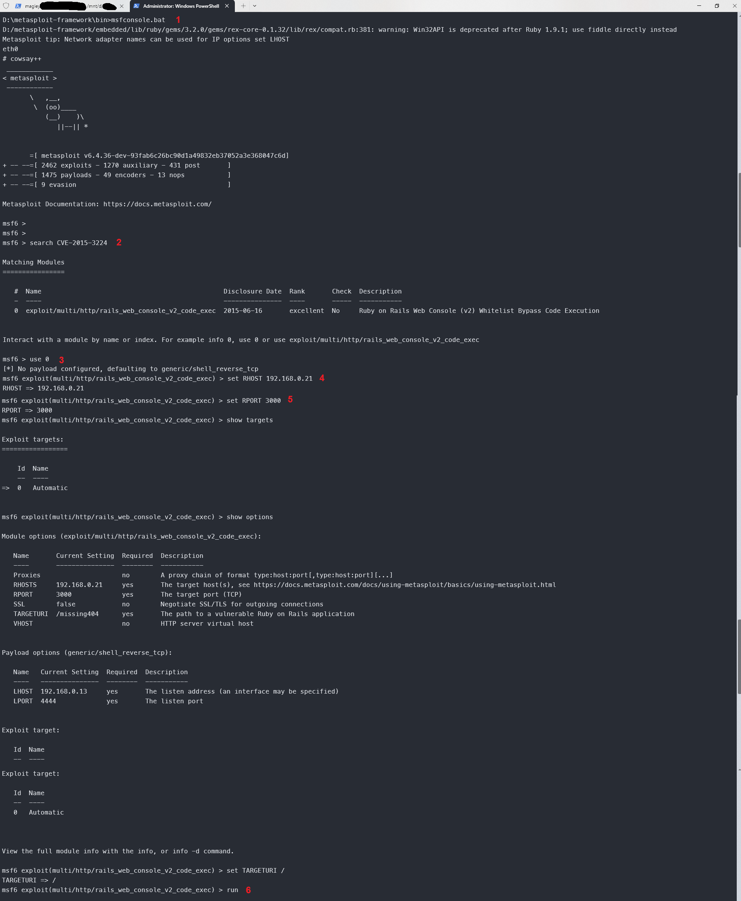
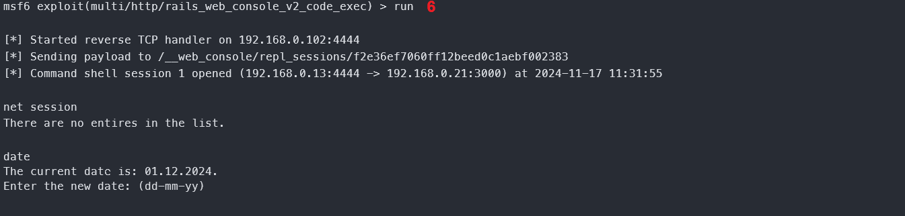
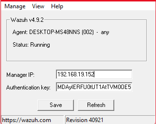
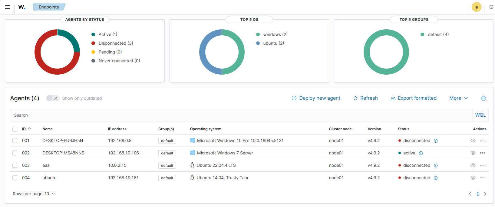
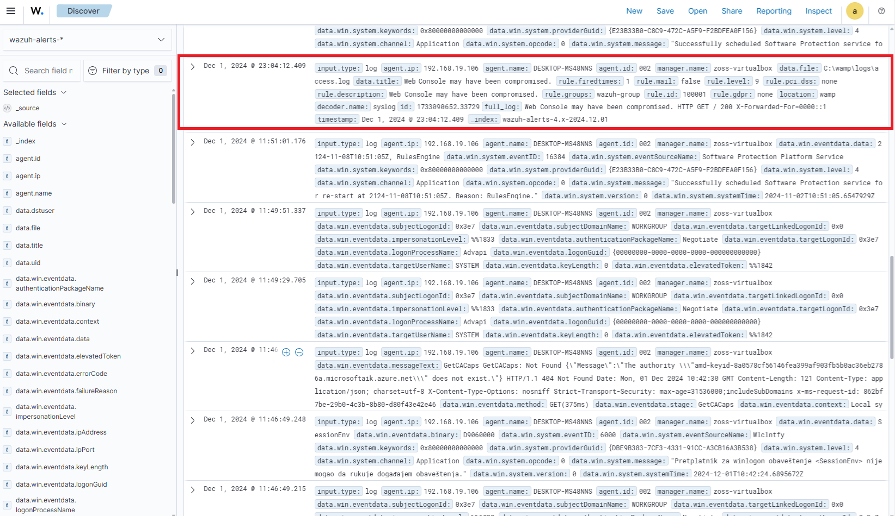

# Eksploatacija ranjivosti, detekcija, i Incident Response izveštaj

### Име и презиме: 
### Датум: 13.11.2024 - 3.12.2024.

---

## Преглед рањивости

### 1.1 Информације о рањивости

- ID рањивости (CVE): CVE-2015-3224
- Погођен сервис: Web Console
- CVSS оцена: 4.3
- Опис рањивости: `Web Console` гем не проверава `X-Forwarded-For` HTTP заглавље како треба, те је могуће спуфовати захтев тако да машина помисли да је захтев потекао са локалне мреже и тиме добити удаљен приступ веб конзоли.

### 1.2 Опис експлоита

**Извор експлоита:**

https://www.exploit-db.com/exploits/41689

**Метод експлоатације:**

1) Нападач шаље dummy захтев са спуфованим ориџином (`X-Forwarded-For` има вредност `0000::1`).
2) Из одговора се чита data-remote-path који показује на Web Console.
3) Нападач зна где је конзола и може да спуфује ориџин, тако да има удаљен приступ конзоли.
4) Омогућен је remote code execution (`{"input": "some_command"}`).
---

## Процес експлоатације

### 2.1 Подешавање експлоита

**Рањив циљ:**

Десктоп машина (нпр. Metasploitable 3, Windows) са `Rails 4.2` (или мање), и у склопу њега `Web Console 2.1.2` (или мање). Порт је `3000`.

**Алати за експлоатацију:**

Metasploit Framework за Windows.

### 2.2 Кораци експлоатације

1. Покренути Metasploit Framework. То је бесплатан алат отвореног кода за експлоатацију рањивости преко командне линије.
У случају windows оперативног система, потребно је преузети [Metasploit инсталер](https://docs.metasploit.com/docs/using-metasploit/getting-started/nightly-installers.html#installing-metasploit-on-windows)
или извршити команду која ради тиху инсталацију. Након тога се позиционирамо у `/bin` директоријум где је инсталиран Metasploit и покренемо Metasploit преко batch скрипте `msfconsole.bat`.
Потребно је неко време да се Metasploit иницира.
2. Извршити претрагу постојећих експлоита за рањивост CVE-2015-3224.
Командом search се претражује база знања Metasploit-а како бисмо пронашли доступне експлоите за задат упит.
Поређење текста се ради регуларним изразима.
На пример, уносом команде `search CVE-2015-3224` ћемо добити списак модула који су везани за `CVE-2015-3224`.
Метасплоит зна да је упит везан за CVE па је задата команда иста као `search cve:3324`.
3. Започети интеракцију са добијеним модулом за тај ескплоит.
Преко команде `use 0` се започиње модул са индексом 0. У нашем случају је то и једини модул који одговара циљаној рањивости.
Промпт ће се променити јер смо сада у контексту модула `multi/http/rails_web_console_v2_code_exec`.
4. Подесити IP адресу рањиве машине.
Коамнда `set RHOST 192.168.19.106` поставља вредност уграђене променљиве `RHOST` (remote host) на `192.168.19.106`, што је IP адреса Metasploitable3
машине (добијена преко `ipconfig`). Постоји и `LHOST` (local host) који се односи на машину која "слуша" исход напада, али њу подразумевано не морамо мењати.
5. Подесити порт рањиве машине на којем трчи сервис који нападамо. Слично претходном кораку, користи се команда `set RPORT 3000`.
Вредност порта је 3000 јер на том порту трчи рањив сервис што је уставнољено током безбедносне анализе и извештавања рањивости. 
6. Иницирати напад одабраног модула. Команда `run` покреће експлоит преко тренутно отвореног модула.



### 2.3 Резултат експлоатације



## Детекција коришћењем Wazuh SIEM-а

### 3.1 Wazuh SIEM правила

**Правила коришћена за детекцију:**

На Wazuh серверу, у `/var/ossec/etc/rules/local_rules.xml`, додати следеће правило (односно групу правила):

```xml
<group name="wazuh-group">
    <rule id="100001" level="9">
        <description>Web Console may have been compromised</description>
        <field>^0000::1$</field>
        <tags>CVE-2015-3224, ruby, rails, RCE</tags>
    </rule>
</group>
```

- ID je `100001` зато што Wazuh очекује да custom правила имају ID у распону од 100000 до 120000.
- Level је `9` јер је то `Error from invalid source` ниво правила. Вредност овог поља може ићи од 0 до 16,
где се level 0 правила игноришу, али се проверавају прва јер се користе као предуслов за друга правила. 
- Опис правила: пошто се рањивост ослања на злоупотребу `X-Forwarded-For` заглавља, можемо једноставно
проверити да ли је дошло до те злоупотребе у самом HTTP захтеву. Упоређујемо вредност према регуларном
изразу `^0000::1$` што ће бити погодак када у логовима наиђемо запис који наведе прокси адресу `0000::1`.
Напомињемо да се ово правило може грешком окинути ако се у логу негде другде пронађе `0000::1`. Да би се ово
заобишло, неопходно би било ући дубље у структуру логова.

### 3.2 Конфигурација SIEM-а

**Подешавање Wazuh агента:**

Вазух агент се подешава на основу инструкција са следећег линка:

https://documentation.wazuh.com/current/installation-guide/wazuh-agent/wazuh-agent-package-windows.html

1) Преузети `wazuh-agent-4.9.2-1.msi`.
2) Инсталирати агента.
3) Отворити GUI апликацију `win32ui.exe`.
4) Стаивити вредност `Manager IP` поља да буде једнака IP адреси Wazuh сервера (слика испод) 



5) Сачувати (Save).
6) По потреби, отворити `Manage > Stop` па `Manage > Start`.
7) Требало би да пише `Status: Running`.



**Прикупљање логова:**

У Metasploitable3-Windows, Rails апликација је подешена да користи Apache Httpd сервер за служење фајлова. Логови се налазе у директоријуму `C:\wamp\logs\access.log`.

Зато је у агенту потребно навести да прикупља логове из те локације. У инсталационом директоријуму Wazuh агента налази се датотека `ossec.conf`. У њој додати:

```xml
<localfile>
  <location>C:/wamp/logs<FILE_PATH>/access.log</location>
  <log_format>syslog</log_format>
</localfile>
```

Након тога треба ресетовати агента: `Manage > Restart`.

### 3.3 Процес детекције

Када се уради покушај напада, требало би да се у веб апликацији испише лог. 



---

## Incident Reponse са The Hive-ом

### 4.1 Подешавање интеграције

**Опис интеграције:**

Праћен је туторијал у следећем линку: https://wazuh.com/blog/using-wazuh-and-thehive-for-threat-protection-and-incident-response/

The Hive је подигнут преко docker compose са следећим compose фајлом:

The Hive нуди REST API за слање инцидената са екстерних сервиса на основу којих се праве случајеви. Потребно је направити корисника са одговарајућим привилегијама (`analyst`). Њему се додељује API кључ.

Да би Wazuh знао да се обрати екстерним сервисима, у конфигурацији се користи `<integrations>` таг. У њему се наводе интеграције са другим сервисима. Постоји неколико "уграђених" сервиса са предефинисаном подршком. Сви остали су "custom" - у нашем случају је и The Hive један од тих. 

```xml
<integration>
    <name>the-hive-integration</name>
    <alert_format>json</alert_format>
    <hook_url>http://localhost:9000/</hook_url>
    <api_key>xkvzbjrMAQqoc+B0qH4pwBvuNIkLD2cs</api_key>
</integration>
```

Да би се интеграција извршила, морамо направити скрипту (на пример пајтон скрипта) која ће се обратити The Hive API-ју. У следећој секцији је описана интеграција правила у интеграцију Wazuh-а са The Hive.

**Интеграција правила:**

Скрипта мора да има исти назив као вредност у `<name>` тагу у интеграцији. Прва линија мора да наведе који је интерпретер у питању.

Користимо `thehive4py` модул за комуникацију и шаљемо `alert` ако су задовољени услови на основу логова које Wazuh произведе.

### 4.2 Креирање случаја у The Hive-у

TODO

### 5 Литература

- https://documentation.wazuh.com/current/user-manual/ruleset/rules/custom.html
- https://documentation.wazuh.com/current/user-manual/ruleset/rules/index.html
- https://documentation.wazuh.com/current/user-manual/ruleset/ruleset-xml-syntax/rules.html#decoded-as
- https://documentation.wazuh.com/current/user-manual/ruleset/rules/rules-classification.html
- https://documentation.wazuh.com/current/user-manual/ruleset/decoders/custom.html
- https://documentation.wazuh.com/current/user-manual/ruleset/decoders/dynamic-fields.html
- https://documentation.wazuh.com/current/user-manual/ruleset/rules/custom.html
- https://wazuh.com/blog/detecting-metasploit-attacks/
- https://wazuh.com/blog/using-wazuh-and-thehive-for-threat-protection-and-incident-response/
- https://github.com/0x00-0x00/CVE-2015-3224
- https://documentation.wazuh.com/current/user-manual/capabilities/log-data-collection/how-it-works.html
- https://documentation.wazuh.com/current/user-manual/manager/integration-with-external-apis.html#custom-integration