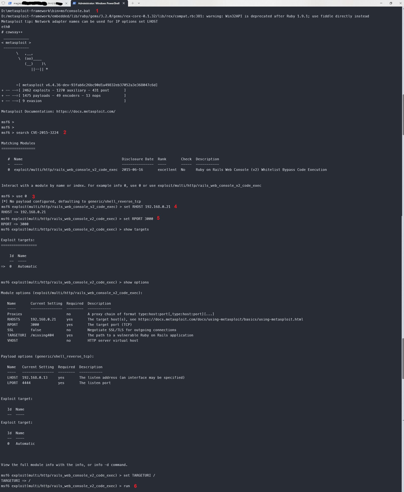
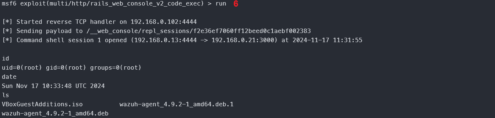
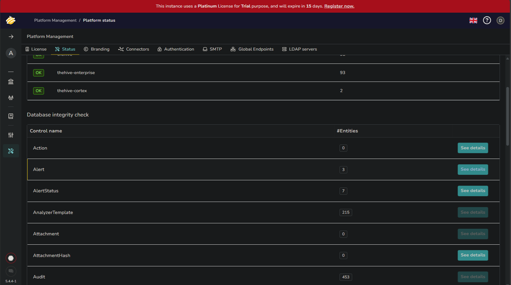

# Eksploatacija ranjivosti, detekcija, i Incident Response izveštaj

### Име и презиме: Лазар Магазин
### Датум: 13.11.2024. - 19.11.2024.

**НАПОМЕНА:** Током израде домаћег сам имао проблема са радом вазух агента, вазух серва, хајв веб интерфејса као и извршавања напада преко метасплоит алата (на убунту рањиву машину). Због тога је извештај писан по резултатима који су прикупљени "модуларно" - све што је описано испод није извршено end-to-end због горенаведених проблема у конфигурисању, лоше документације и недовољно хардверских ресурса.

---

## Преглед рањивости

### 1.1 Информације о рањивости

- ID рањивости (CVE): CVE-2015-3224
- Погођен сервис: Web Console
- CVSS оцена: 4.3
- Опис рањивости: `Web Console` гем не проверава `X-Forwarded-For` HTTP заглавље како треба, те је могуће спуфовати захтев тако да машина помисли да је захтев потекао са локалне мреже и тиме добити удаљен приступ веб конзоли.

### 1.2 Опис експлоита

**Извор експлоита:**

https://www.exploit-db.com/exploits/41689

**Метод експлоатације:**

1) Нападач шаље dummy захтев са спуфованим ориџином (`X-Forwarded-For` има вредност `0000::1`).
2) Из одговора се чита data-remote-path који показује на Web Console.
3) Нападач зна где је конзола и може да спуфује ориџин, тако да има удаљен приступ конзоли.
4) Омогућен је remote code execution (`{"input": "some_command"}`).
---

## Процес експлоатације

### 2.1 Подешавање експлоита

**Рањив циљ:**

Десктоп машина (нпр. Metasploitable 3) са `Rails 4.2` (или мање), и у склопу њега `Web Console 2.1.2` (или мање). Порт је `3000`.

**Алати за експлоатацију:**

Metasploit Framework за Windows.

### 2.2 Кораци експлоатације

1. Покренути Metasploit Framework. То је бесплатан алат отвореног кода за експлоатацију рањивости преко командне линије.
У случају windows оперативног система, потребно је преузети [Metasploit инсталер](https://docs.metasploit.com/docs/using-metasploit/getting-started/nightly-installers.html#installing-metasploit-on-windows)
или извршити команду која ради тиху инсталацију. Након тога се позиционирамо у `/bin` директоријум где је инсталиран Metasploit и покренемо Metasploit преко batch скрипте `msfconsole.bat`.
Потребно је неко време да се Metasploit иницира.
2. Извршити претрагу постојећих експлоита за рањивост CVE-2015-3224.
Командом search се претражује база знања Metasploit-а како бисмо пронашли доступне експлоите за задат упит.
Поређење текста се ради регуларним изразима.
На пример, уносом команде `search CVE-2015-3224` ћемо добити списак модула који су везани за `CVE-2015-3224`.
Метасплоит зна да је упит везан за CVE па је задата команда иста као `search cve:3324`.
3. Започети интеракцију са добијеним модулом за тај ескплоит.
Преко команде `use 0` се започиње модул са индексом 0. У нашем случају је то и једини модул који одговара циљаној рањивости.
Промпт ће се променити јер смо сада у контексту модула `multi/http/rails_web_console_v2_code_exec`.
4. Подесити IP адресу рањиве машине.
Коамнда `set RHOST 192.168.0.21` поставља вредност уграђене променљиве `RHOST` (remote host) на `192.168.0.21`, што је IP адреса Metasploitable3
машине (добијена преко `ifconfig eth0`). Постоји и `LHOST` (local host) који се односи на машину која "слуша" исход напада, али њу подразумевано не морамо мењати.
5. Подесити порт рањиве машине на којем трчи сервис који нападамо. Слично претходном кораку, користи се команда `set RPORT 3000`.
Вредност порта је 3000 јер на том порту трчи рањив сервис што је уставнољено током безбедносне анализе и извештавања рањивости. 
6. Иницирати напад одабраног модула. Команда `run` покреће експлоит преко тренутно отвореног модула.



### 2.3 Резултат експлоатације



Добили смо root корисника што се види преко `id` команде.

## Детекција коришћењем Wazuh SIEM-а

### 3.1 Wazuh SIEM правила

**Правила коришћена за детекцију:**

На Wazuh серверу, у `/var/ossec/etc/rules/local_rules.xml`, додати следеће правило (односно групу правила):

```xml
<group name="wazuh-group">
    <rule id="100001" level="10">
        <description>Web Console may have been compromised</description>
        <decoded_as>json</decoded_as>
        <field name="data.http.headers.X-Forwarded-For">^0000::1$</field>
        <tags>CVE-2015-3224, ruby, rails, RCE</tags>
    </rule>
</group>
```

- ID je `100001` зато што Wazuh очекује да custom правила имају ID у распону од 100000 до 120000.
- Опис правила: пошто се рањивост ослања на злоупотребу `X-Forwarded-For` заглавља, можемо једноставно
проверити да ли је дошло до те злоупотребе у самом HTTP захтеву. Упоређујемо вредност према регуларном
изразу `^0000::1$` што значи да гледамо да ли `X-Forwarded-For` има тачно вредност `0000::1`.

### 3.2 Конфигурација SIEM-а

**Подешавање Wazuh агента:**

- Преко веб апликације Wazuh сервера отворити чаробњака за креирање новог агента.
- Одабрати Debian Amd64
- Унети IP адресу Wazuh сервера
- Ставити назив `metasploitable3-ubuntu`
- Wazuh сервера ће дати команду да се преузме одговарајућа скрипту за агента
- Прекуцати команде (copy-paste не ради ако је Windows Host а Linux Guest у VirtualBox-у) у рањивој машини
- Покренути агента (исто је дата команда, с тим што Metasploitable3 нема systemd, па се он мора инсталирати, или покренути ручно: `/var/ossec/bin/wazuh-control start`)

**Прикупљање логова:**

Није ми јасно на које се логове мисли.

### 3.3 Процес детекције

Када се уради покушај напада, требало би да се у веб апликацији испише лог. Следи исечак лога једног реда у табели:

```json
{
  "timestamp": "2024-11-16T22:57:46.000Z",
  "rule": {
    "level": 10,
    "description": "Web Console may have been compromised",
    "id": "100001",
    "firedtimes": 1,
    "mail": false,
    "groups": [
      "wazuh-group"
    ]
  },
  "agent": {
    "id": "001",
    "name": "metasploitable3-ubuntu"
  },
  "manager": {
    "name": "wazuh-manager"
  },
  "id": "16777217",
  "full_log": "{\"data\":{\"http\":{\"headers\":{\"X-Forwarded-For\":\"0000::1\"}}}}",
  "decoder": {
    "name": "json"
  },
  "data": {
    "http": {
      "headers": {
        "X-Forwarded-For": "0000::1"
      }
    }
  },
  "location": "/var/log/httpd/access_log"
}
```

---

## Incident Reponse са The Hive-ом

### 4.1 Подешавање интеграције

**Опис интеграције:**

The Hive нуди REST API за слање инцидената са екстерних сервиса на основу којих се праве случајеви. Потребно је направити корисника са одговарајућим привилегијама (`analyst`). Њему се додељује API кључ.

Да би Wazuh знао да се обрати екстерним сервисима, у конфигурацији се користи `<integrations>` таг. У њему се наводе интеграције са другим сервисима. Постоји неколико "уграђених" сервиса са предефинисаном подршком. Сви остали су "custom" - у нашем случају је и The Hive један од тих. 

```xml
<integration>
    <name>the-hive-integration</name>
    <alert_format>json</alert_format>
    <hook_url>http://localhost:9000/</hook_url>
    <api_key>xkvzbjrMAQqoc+B0qH4pwBvuNIkLD2cs</api_key>
</integration>
```

Да би се интеграција извршила, морамо направити скрипту (на пример пајтон скрипта) која ће се обратити The Hive API-ју. У следећој секцији је описана интеграција правила у интеграцију Wazuh-а са The Hive.

**Интеграција правила:**

Скрипта мора да има исти назив као вредност у `<name>` тагу у интеграцији. Прва линија мора да наведе који је интерпретер у питању.

Користимо `thehive4py` модул за комуникацију и шаљемо `alert` ако су задовољени услови на основу логова које Wazuh произведе:

```py
#!/usr/bin/env python
import json
import sys
import os
import logging
from thehive4py.api import TheHiveApi
from thehive4py.models import Alert, AlertArtifact

# Configuration
lvl_threshold = 10
thehive_url = 'http://localhost:9000/'
thehive_api_key = 'xkvzbjrMAQqoc+B0qH4pwBvuNIkLD2cs'

# Logging setup
log_file = '/var/ossec/logs/integrations.log'
logging.basicConfig(filename=log_file, level=logging.INFO)

def main(args):
    alert_file = args[1]
    with open(alert_file, 'r') as f:
        alert = json.load(f)

    if alert['rule']['level'] >= lvl_threshold:
        thehive = TheHiveApi(thehive_url, thehive_api_key)
        alert_artifacts = [AlertArtifact(dataType='ip', data=alert['data']['http']['headers']['X-Forwarded-For'])]
        thehive_alert = Alert(title=alert['rule']['description'], description=str(alert), artifacts=alert_artifacts)
        response = thehive.create_alert(thehive_alert)
        logging.info(f'Alert sent to The Hive: {response.json()}')

if __name__ == '__main__':
    main(sys.argv)
```

### 4.2 Креирање случаја у The Hive-у

(Имао сам проблем са покретањем The Hive-а, логовањем преко конкретног корисничког налога и прегледом случаја. Вероватно је проблем до docker-compose конфигурационог фајла зато што другачије нисам могао. Из тог разлога прилажем следећи скриншот где се може утврдити да The Hive прима инцидент преко API-ја.)



### 5 Литература

- https://documentation.wazuh.com/current/user-manual/ruleset/decoders/dynamic-fields.html
- https://documentation.wazuh.com/current/user-manual/ruleset/rules/custom.html
- https://wazuh.com/blog/detecting-metasploit-attacks/
- https://wazuh.com/blog/using-wazuh-and-thehive-for-threat-protection-and-incident-response/
- https://github.com/0x00-0x00/CVE-2015-3224
- https://documentation.wazuh.com/current/user-manual/capabilities/log-data-collection/how-it-works.html
- https://documentation.wazuh.com/current/user-manual/manager/integration-with-external-apis.html#custom-integration