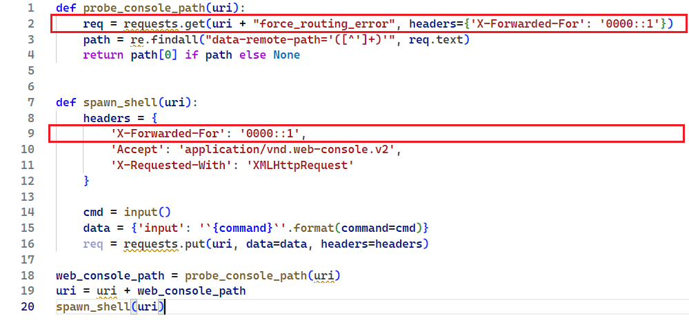
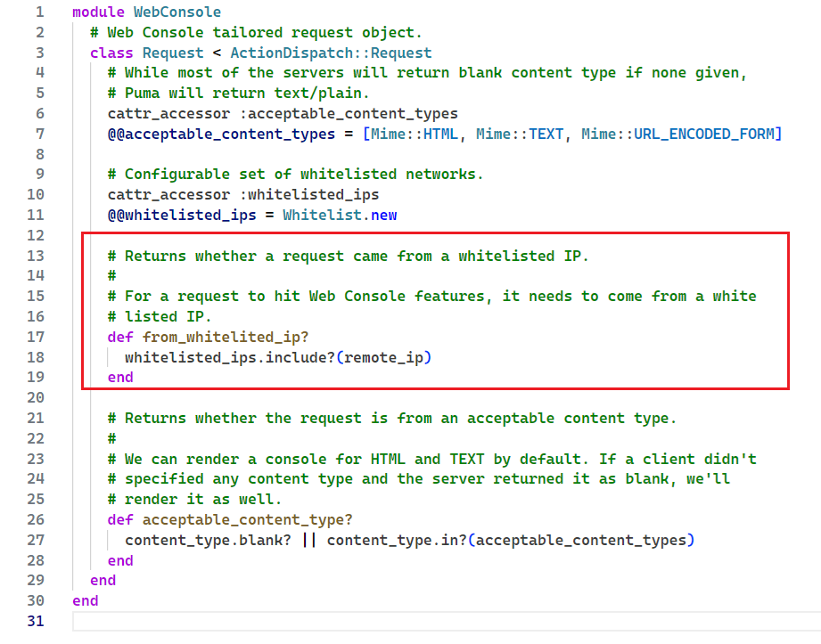

**Име и презиме**: Лазар Магазин

**Тим**: 2

**Датум**: 24.10.2024. - 26.10.2024.

**Scan Tool**: Nessus 10.8.3, и ручно

**Тест окружење**: Metasploitable 3 (Ubuntu)

---

**1. Енумерација CVE-а**

* **CVE ID**: CVE-2015-3224

* **Опис**: 

`Web Console` је гем фрејмворка Ruby On Rails који омогућава креирање
интерактивне конзолне Ruby сесије кроз веб страницу. Он садржи пропуст у коду
због којег је могуће спуфовати IP адресу и добити приступ конзоли.

Конкретно, `Web Console` дозвољава приступ само одређеним IP адресама које у whitelist-оване. То су обично `localhost` адресе, односно приступ је могућ само изнутра.

Међутим, `Web Console` ће током контроле приступа узети последњу вредност из `X-Forwarded-For` HTTP заглавља (ако оно постоји). 

`X-Forwarded-For` је поље у HTTP заглављу које чува списак IP адреса које су прошле кроз све прокси 
сервисе. Ово заглавље се може спуфовати да има вредност `0000::1` (IPv6 loopback) и онда `Web Console` игнорише праву IP адресу захтева (која не може да се спуфује*) и приступ бива омогућен.

На Metasploitable 3, `chatbot` сервер користи Ruby On Rails 4.1.1 који зависи од Web Console верзије 2.1.3 (или мање?) а која је подложна овом нападу. Апликативни сервер користи HTTP протокол и трчи на порту 3000. 

---

**2. CVSS 2.0 скор**

* **CVSS скор (нумеричка вредност)**: 4.3

* **Вектор**:
  - **Access Vector (AV)**: Network - напад се може извести са удаљене мреже
  - **Access Complexity (AC)**: Medium - напад није тривијалан али не захтева привилеговане механизме нити висок опрез 
  - **Authentication (AU)**: None - аутентификација није потребна, само се пошаље захтев
  - **Confidentiality (C)**: None - Напад не угрожава поверљивост података у модулу
  - **Integrity (I)**: Partial - Нападач има ограничену моћ модификације података у модулу (зависи од тога колику контролу нападач има)
  - **Availability (A)**: None - Напад не угрожава доступност модула
  - **Additional Information**: Allows unauthorized modification

* **Оправдање**:
  - Експлоатабилност је `8.6` зато што је приступ могућ преко мреже, што значи да напад може бити _remote_. Додатно, напад је могуће извршити без аутентификације или посебних привилегија што максимизује ко све може да нападне. Међутим, приступ је могућ само при подразумеваној конфигурацији и то у "идеалним" условима због чега експлоатабилност није већа (10).
  - Impact је `2.9` јер од CIA тријаде, једино је могуће нарушити интегритет и то до одређеног досега јер Web Console нема root привилегије.
  - Обим рањивости обухвата саму Rails апликацију, и контекст веб контролера у склопу којег је конзолна сесија отворена. То ефективно значи да нападач нема исту моћ као када би добио remote shell приступ.

---

**3. Доступност експлоита**

* **Постоји јавно доступан експлоит (Да/Не)**: Да.
  - https://www.exploit-db.com/exploits/41689
  - https://github.com/0xEval/cve-2015-3224/blob/master/cve-2015-3224.py (демонстриран овде)

* **Опис експлоита**: 

Експлоит лоцира Web Console и добија му приступ преко спуфоване адресе чиме је могуће слати remote команде. 

1) Нападач шаље dummy захтев са спуфованим ориџином.
2) Из одговора се чита `data-remote-path` који показује на `Web Console`
3) Нападач зна где је конзола и може да спуфује оригиџин, тако да има удаљен приступ конзоли.
4) Могућ је **arbitrary code execution**.

* **Код експлоита (уколико постоји)**:

---

**4. Анализа узрока (root cause)**

* **Увођење грешке (Commit/верзија)**: `Rails 4.2` и мање користе `Web Console 2.1.2` и мање.

Грешка је присутна од комита [d4e9935](https://github.com/rails/web-console/blob/d4e9935cf61aef54b598c5b948220aac24846966/lib/web_console/middleware.rb#L48) где је ово филтрирање иницијално имплементирано.

Наиме, Rails 4.1.x садржи прокси адресе којима се имплицитно верује у виду регуларних израза. Од значаја су `127.0.0.1` или `::1`. Ово се проверава помоћу регуларних израза (за експлоит је релевантан израз `^::1$`). Дозвољене адресе бивају филтриране из `X-Forwarded-For` заглавља.

Са друге стране, Web Console подразумевано верује адресама `127.0.0.1` and `::1`, и то се проверава помоћу Ruby класе `IPAddr`.

Ако у `X-Forwarded-For` проследимо `0000::1` (што је еквивалентно са `::1`), Rails интерно неће филтрирати ту адресу јер се не уклапа у израз `^::1$`. Web Console филтрирање IP адреса ће проћи, зато што су оне исте адресе (јер су сви сегменти 0 у `IPAddr` објекту).  

* **Пример кода (ако је применљиво)**:

---

**5. Препоруке за митигацију**

* **Да ли је доступан Vendor Fix или patch (Да/не)**: Да
  - `Web Console >=2.1.3`
  - или печ https://bugzilla-attachments.redhat.com/attachment.cgi?id=1040553)

* **Mitigation strategy**: Ажурирање Rails `rails app:update`

* **Алтернативни fix (уколико не постоји вендорски)**: У случају да није могуће ажурирати новију верзију Rails библиотеке (или само Web Console), потребно је искључити Web Console.

---

Извори и литература:

- https://www.tenable.com/plugins/nessus/84452
- https://www.tenable.com/cve/CVE-2015-3224
- https://www.cvedetails.com/cve/CVE-2015-3224/
- https://github.com/rubysec/ruby-advisory-db/blob/master/gems/web-console/CVE-2015-3224.yml
- https://github.com/rails/web-console/compare/v2.1.2...v2.1.3
- https://www.first.org/cvss/v2/guide#2-1-Base-Metrics
- https://developer.mozilla.org/en-US/docs/Web/HTTP/Headers/X-Forwarded-For
- https://www.exploit-db.com/exploits/41689
- https://github.com/0xEval/cve-2015-3224/blob/master/cve-2015-3224.py
- https://hackerone.com/reports/44513
- https://github.com/rails/web-console/blob/d4e9935cf61aef54b598c5b948220aac24846966/lib/web_console/middleware.rb#L48
- https://nvd.nist.gov/vuln-metrics/cvss/v2-calculator?name=CVE-2015-3224&vector=(AV:N/AC:M/Au:N/C:N/I:P/A:N)&version=2.0&source=NIST