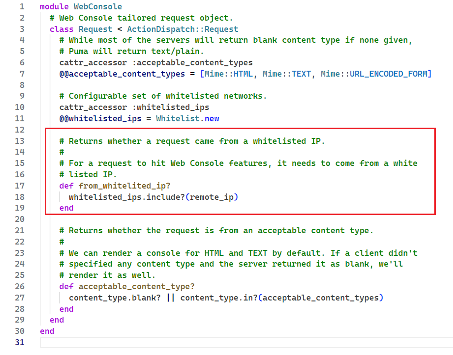
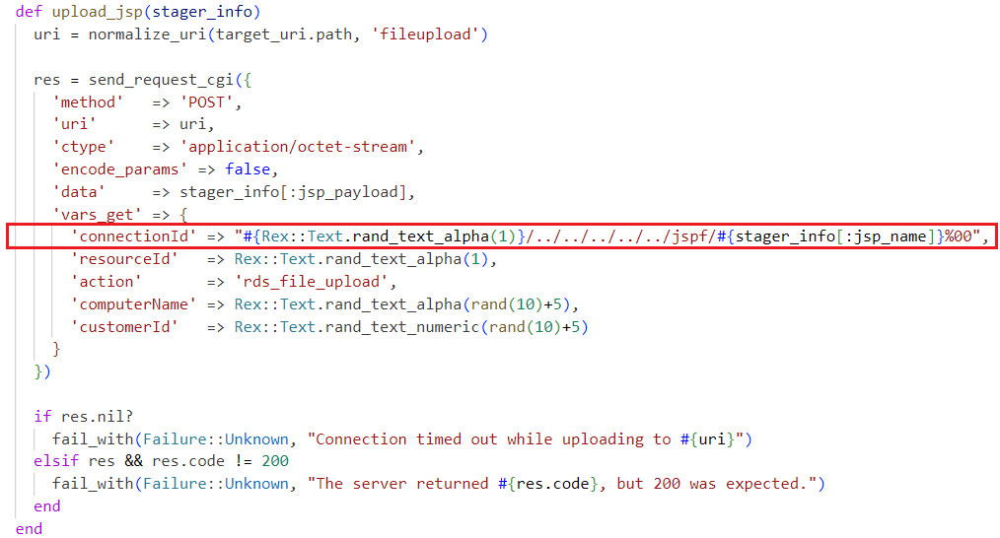
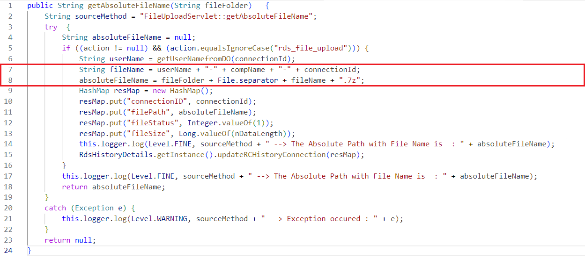
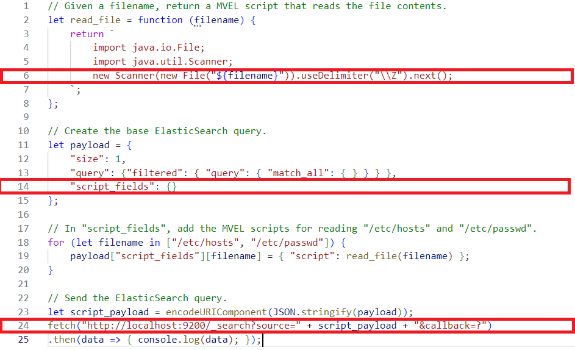
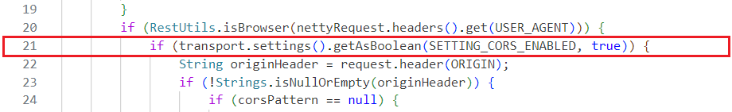

**Име и презиме**: Лазар Магазин

**Тим**: 2

**Датум**: (24.10.2024. - 26.10.2024.), (1.11.2024.)

**Scan Tool**: Nessus 10.8.3, и ручно

**Тест окружење**: Metasploitable 3 (Ubuntu, Windows Server)

---

## Прва рањивост

### 1. Енумерација CVE-а

* **CVE ID**: CVE-2015-3224

* **Опис**: 

`Web Console` је гем фрејмворка Ruby On Rails који омогућава креирање
интерактивне конзолне Ruby сесије кроз веб страницу. Он садржи пропуст у коду
због којег је могуће спуфовати IP адресу и добити приступ конзоли.

Конкретно, `Web Console` дозвољава приступ само одређеним IP адресама које у whitelist-оване. То су обично `localhost` адресе, односно приступ је могућ само изнутра.

Међутим, `Web Console` ће током контроле приступа узети последњу вредност из `X-Forwarded-For` HTTP заглавља (ако оно постоји). 

`X-Forwarded-For` је поље у HTTP заглављу које чува списак IP адреса које су прошле кроз све прокси 
сервисе. Ово заглавље се може спуфовати да има вредност `0000::1` (IPv6 loopback) и онда `Web Console` игнорише праву IP адресу захтева (која не може да се спуфује*) и приступ бива омогућен.

На Metasploitable 3, `chatbot` сервер користи Ruby On Rails 4.1.1 који зависи од Web Console верзије 2.1.3 (или мање?) а која је подложна овом нападу. Апликативни сервер користи HTTP протокол и трчи на порту 3000. 

---

### 2. CVSS 2.0 скор

* **CVSS скор (нумеричка вредност)**: 4.3

* **Вектор**:
  - **Access Vector (AV) (где је могуће извршити напад)**: Network - напад се може извести са удаљене мреже, односно нападач не мора бити физички повезан на модул
  - **Access Complexity (AC) (колико је тешко извршити напад)**: Medium - напад није тривијалан јер може зависити од конфигурације система, али не захтева привилеговане механизме, висок опрез нити дубоко техничко разумевање 
  - **Authentication (AU) (каква је аутентификација потребна да би се напад извршио)**: None - аутентификација није потребна, само се пошаље захтев
  - **Confidentiality (C) (у којој мери напад нарушава поверљивост модула)**: None - Напад не угрожава поверљивост података у модулу зато што се напад не ослања на злоупотребу података
  - **Integrity (I) (у којој мери напад нарушава интегритет модула)**: Partial - Нападач има делимичну моћ модификације података у модулу (зависи од тога колику контролу нападач има, односно колики је досег контролера над којим је отворена конзола)
  - **Availability (A) (у којој мери напад нарушава доступност модула)**: None - Напад не угрожава доступност модула
  - **Additional Information**: Allows unauthorized modification

* **Оправдање**:
  - Експлоатабилност је `8.6` зато што је приступ могућ преко мреже што омогућава "свима" да изврше напад. Исто тако, напад је могуће извршити без аутентификације или посебних привилегија што максимизује ко све може да нападне. Међутим, приступ је могућ само при подразумеваној конфигурацији, у "идеалним" условима, и над Rails сервером односно једним његовим контролером, због чега експлоатабилност није већа (10).
  - Impact је `2.9` јер од CIA тријаде, једино је могуће нарушити интегритет и то до одређеног досега јер Web Console нема root привилегије.
  - Обим рањивости обухвата саму Rails апликацију, интерне конфигурације и податке. Пошто root приступ (вероватно) није могућ, добро заштићен сервер нема велик обим рањивости. 
  - Другим речима, иако је напад прост за извршити и омогућава извршавање команди, он је ограничен на сму апликацију и не може да учини дуготрајну штету на остатак система. 

---

### 3. Доступност експлоита

* **Постоји јавно доступан експлоит (Да/Не)**: Да.
  - https://www.exploit-db.com/exploits/41689
  - https://github.com/0xEval/cve-2015-3224/blob/master/cve-2015-3224.py (демонстриран овде)

* **Опис експлоита**: 

Експлоит лоцира Web Console и добија му приступ преко спуфоване адресе чиме је могуће слати remote команде. 

1) Нападач шаље dummy захтев са спуфованим ориџином.
2) Из одговора се чита `data-remote-path` који показује на `Web Console`
3) Нападач зна где је конзола и може да спуфује оригиџин, тако да има удаљен приступ конзоли.
4) Могућ је **arbitrary code execution**.

* **Код експлоита (уколико постоји)**:


---

### 4. Анализа узрока (root cause)

* **Увођење грешке (Commit/верзија)**: `Rails 4.2` и мање користе `Web Console 2.1.2` и мање.

Грешка је присутна од комита [d4e9935](https://github.com/rails/web-console/blob/d4e9935cf61aef54b598c5b948220aac24846966/lib/web_console/middleware.rb#L48) где је ово филтрирање иницијално имплементирано.

Наиме, Rails 4.1.x садржи прокси адресе којима се имплицитно верује у виду регуларних израза. Од значаја су `127.0.0.1` или `::1`. Ово се проверава помоћу регуларних израза (за експлоит је релевантан израз `^::1$`). Дозвољене адресе бивају филтриране из `X-Forwarded-For` заглавља.

Са друге стране, Web Console подразумевано верује адресама `127.0.0.1` and `::1`, и то се проверава помоћу Ruby класе `IPAddr`.

Ако у `X-Forwarded-For` проследимо `0000::1` (што је еквивалентно са `::1`), Rails интерно неће филтрирати ту адресу јер се не уклапа у израз `^::1$`. Web Console филтрирање IP адреса ће проћи, зато што су оне исте адресе (јер су сви сегменти 0 у `IPAddr` објекту).  


* **Пример кода (ако је применљиво)**:



---

### 5. Препоруке за митигацију

* **Да ли је доступан Vendor Fix или patch (Да/не)**: Да
  - `Web Console >=2.1.3`
  - или печ https://bugzilla-attachments.redhat.com/attachment.cgi?id=1040553)

* **Mitigation strategy**: Ажурирање Rails `rails app:update`

* **Алтернативни fix (уколико не постоји вендорски)**: У случају да није могуће ажурирати новију верзију Rails библиотеке (или само Web Console), потребно је искључити Web Console.

---

### 6. Извори и литература:

- https://www.tenable.com/plugins/nessus/84452
- https://www.tenable.com/cve/CVE-2015-3224
- https://www.cvedetails.com/cve/CVE-2015-3224/
- https://github.com/rubysec/ruby-advisory-db/blob/master/gems/web-console/CVE-2015-3224.yml
- https://github.com/rails/web-console/compare/v2.1.2...v2.1.3
- https://www.first.org/cvss/v2/guide#2-1-Base-Metrics
- https://developer.mozilla.org/en-US/docs/Web/HTTP/Headers/X-Forwarded-For
- https://www.exploit-db.com/exploits/41689
- https://github.com/0xEval/cve-2015-3224/blob/master/cve-2015-3224.py
- https://hackerone.com/reports/44513
- https://github.com/rails/web-console/blob/d4e9935cf61aef54b598c5b948220aac24846966/lib/web_console/middleware.rb#L48
- https://nvd.nist.gov/vuln-metrics/cvss/v2-calculator?name=CVE-2015-3224&vector=(AV:N/AC:M/Au:N/C:N/I:P/A:N)&version=2.0&source=NIST

## Друга рањивост

### 1. Енумерација CVE-а

* **CVE ID**: CVE-2015-8249 

* **Опис**: 

Један од рањивих сервиса на Metasploitable 3 за Windows Server је **ManageEngine
Desktop Central 9 (build 91084)**. Његова улога је да олакша администраторима да
управља серверима, десктоп и мобилним уређајима: конкретно то подразумева
печовање, испоруку софтвера, управљање површином напада, remote управљање
рачунарима итд.

Испод хаубе користи Apache Httpd сервер и трчи на портовима:
1. `8200` за HTTP
2. `8383` за HTTPs

Један од сервлета који Desktop Central користи је `FileUploadServlet` који
преузима окачен фајл на уређај. Један од параметара, `connectionId`, које
корисник наводи и чини саставни део путање фајла који качимо, се **не
валидира**.

Због тог пропуста, нападач може да проследи малициозну датотеку - извршив код -
који ће сервер покренути. Другим речима, ова рањивост омогућава **Arbitrary Code
Execution** напад. 

---

### 2. CVSS 3.0 скор

* **CVSS скор (нумеричка вредност)**: 9.8 (критична рањивост)

* **Вектор**:
  - **Attack Vector (AV) (одакле је могуће извршити напад)**: Network - напад се може извести са удаљене мреже, односно нападач не мора бити физички повезан на модул 
  - **Access Complexity (AC) (колико су сложени услови у којима нападач извршава напад)**: Low - напад је тривијалан за извршити
  - **Privileges Required (PR) (да ли су потребне посебне привилегије у виду аутентификације и сл. да би се рањивост злоупотребила)**: None - нападач није ауторизован пред извршење напада
  - **User Interaction (UI) (да ли је потребна интеракција неког другог корисника или актера мимо нападача да би се напад извршио)**: None - напад се извршава самостално
  - **Scope (S) (да ли је досег напада већи од досега рањиве компоненте)**: Unchanged - напад може злоупотребити само ресурсе над којима рањива компонента има контролу
  - **Confidentiality (C) (у којој мери напад нарушава поверљивост модула)**: High - долази до потпуног губитка поверљивости података јер нападач добија приступ свим ресурсима модула
  - **Integrity (I) (у којој мери напад нарушава интегритет модула)**: High - долази до потпуног губитка интегритета података јер нападач може да измени њихов садржај
  - **Availability (A) (у којој мери напад нарушава доступност модула)**: High - долази до потпуног губитка доступности јер нападач може да спречи приступ ресурсима привемено или трајно

* **Оправдање**:
  - Експлоатабилност је `3.9`
  - Impact је `5.9`
  - Обим рањивости чини ManageEngine Desktop Central и сви ресурси којима она има приступ. 
  - CVSS скор је толико висок је у питању рањивост којом је могућ arbitrary code execution. Нападач може извршити произвољне скрипте и тако у потпуности наруши систем. Напад је могуће извршити на даљину, не захтева аутентификацију и у нападу не учествују други корисници. CVSS није `10.0` због тога што су компонента напада и рањива компонента исте - односно напад не може да учини штету ван контекста ManageEngine Desktop Central сервиса.
---
---


### 3. Доступност експлоита

* **Постоји јавно доступан експлоит (Да/Не)**: Да, и експлоит је **верификован**.
  - https://www.exploit-db.com/exploits/38982

* **Опис експлоита**: 

1) Креира се бинарни фајл који ће се извршити на серверу.
2) Креира се JSP фајл који запише бинарни фајл на сервер а га изврши преко `Runtime.getRuntime().exec()`.
3) Тај JSP је пошаље преко Desktop Central-овог API-ја. За одабир `connectionId` параметра се умеће `%00` што је срж овог напада. 
4) Desktop Central он ће датотеку упаковати према задатим параметраима у `7z` архиву. 
5) Слањем `GET` захтева на тај ресурс се извршава бинарни фајл.

* **Код експлоита (уколико постоји)**:



---

### 4. Анализа узрока (root cause)

* **Увођење грешке (Commit/верзија)**: Desktop Central build 90109. 

Комит није познат јер је сервис затвореног кода.

Назив датотеке се одређује на основу параметара:
* `userName` (параметар захтева `customerId`)
* `compName` (параметар захтева `computerName`)
* `connectionId` (параметар захтева `connectionId`)

На који се на крају додаје `.7z`. Пошто се `connectionId` нигде не проверава, може се поставити вредност:

```
malicious.jsp%00
```

чиме назив датотеке постаје:

```
{userName}-{compName}-malicious.jsp%00.7z
```

што ће бити сачувано као:

```
{userName}-{compName}-malicious.jsp
```

* **Пример кода (ако је применљиво)**:

**Напомена**: Код је добијен декомпајлирањем _ManageEngine Desktop Central 9_ 
([извор](https://www.rapid7.com/blog/post/2015/12/14/r7-2015-22-manageengine-desktop-central-9-fileuploadservlet-connectionid-vulnerability-cve-2015-8249/#:~:text=String%20fileName%20%3D%20userName%20%2B%20%22%2D%22%20%2B%20compName%20%2B%20%22%2D%22%20%2B%20connectionId%3B%20%20%0A%20%20%20%20%20%20%20%20absoluteFileName%20%3D%20fileFolder%20%2B%20File.separator%20%2B%20fileName%20%2B%20%22.7z%22%3B)).



---

### 5. Препоруке за митигацију

* **Да ли је доступан Vendor Fix или patch (Да/не)**: Да

Нова верзија: `Desktop Central build 91099` која валидира `connectionId`.

* **Mitigation strategy**:

Инсталирати `ManageEngine Application Manager` и покренути команду:
```sh
<Application Manager Install Directory>/bin/updateManager.bat -c
```

* **Алтернативни fix (уколико не постоји вендорски)**: /

---

### 6. Извори и литература:

- https://nvd.nist.gov/vuln/detail/CVE-2015-8249
- https://www.rapid7.com/blog/post/2015/12/14/r7-2015-22-manageengine-desktop-central-9-fileuploadservlet-connectionid-vulnerability-cve-2015-8249/
- https://www.hackingtutorials.org/metasploit-tutorials/metasploitable-3-exploiting-manageengine-desktop-central-9/

## Трећа рањивост

### 1. Енумерација CVE-а

* **CVE ID**: CVE-2014-3120

* **Опис**: 

**ElasticSearch** је сервис за брзу претрагу текста заснован на Apache Lucene.
Он подржава скрипте преко **MVEL**-а: скрипт језика који подсећа на Javu.

Верзија ElasticSearch-a пре 1.2 има рањивост у својој подразумеваној конфигурацији
због којег је могуће извршити произвољне MVEL и Java скрипте, под условом да
сервис не трчи изоловано од host машине.

Metasploitable 3 је конфигурисана тако да ElasticSearch 1.2 није у виртуелној
машини, те је он рањив на нападе који ће бити описани у наставку.

ElasticSearch користи HTTP протокол и трчи на порту 9200 у Metasploitable 3 (што
је уједно и подразумевани порт за овај сервис).

---

### 2. CVSS 2.0 скор

* **CVSS скор (нумеричка вредност)**: 6.8

* **Вектор**:
  - **Access Vector (AV) (где је могуће извршити напад)**: Network - напад се може извести са удаљене мреже, односно нападач не мора бити физички повезан на модул
  - **Access Complexity (AC) (колико је тешко извршити напад)**: Medium - напад није тривијалан јер може зависити од конфигурације система, али не захтева привилеговане механизме, висок опрез нити дубоко техничко разумевање 
  - **Authentication (AU) (каква је аутентификација потребна да би се напад извршио)**: None - аутентификација није потребна
  - **Confidentiality (C) (у којој мери напад нарушава поверљивост модула)**: Partial - долази до делимичног губитка поверљивости података јер нападач добија приступ неким од ресурса модула
  - **Integrity (I) (у којој мери напад нарушава интегритет модула)**: Partial - долази до делимичног губитка интегритета података јер нападач може да измени садржај неким од података
  - **Availability (A) (у којој мери напад нарушава доступност модула)**: Partial - долази до делимичног губитка доступности јер нападач може да покрене скрипту којом се гуши систем

* **Оправдање**:
  - Експлоатабилност је `8.6` зато што је приступ могућ преко мреже што омогућава "свима" да изврше напад. Исто тако, напад је могуће извршити без аутентификације или посебних привилегија што максимизује ко све може да нападне. Међутим, приступ је могућ само под претпоставком да ElasticSearch није изолован од оперативног система (путем нпр. хипервизора или контејнера) те експлоатабилност не може бити већа.
  - Impact је `6.4` јер је читава CIA тријада подложне нарушавању у некој мери. Досег злоупотребе ове рањивости је ограничена на ElasticSearch те је утицај само 6.4.
  - Обим рањивости обухвата ElasticSearch.
  - Напад је релативно једноставан за извршити. Међутим, он претпоставља директно успостављен ElasticSearch као и неизмењену вредност за покретање скрипти у конфигурацији - а вероватноћа да се ово деси је јако мала **у општем случају**, те је CVSS 6.8. 

---

### 3. Доступност експлоита

* **Постоји јавно доступан експлоит (Да/Не)**: Да, и експлоит је **верификован**.
  - https://www.exploit-db.com/exploits/33370

* **Опис експлоита**: 

1) Направити MVEL скрипту која ће прочитати фајл.
2) Уметнути код те скрипте у ElasticSearch упит.
3) Покренути ElasticSearch упит.
4) Прочитати резултат ElasticSearch упита.

* **Код експлоита (уколико постоји)**:

_напомена: на слици се налази поједностављена верзија експлоита где су избачени непотребни делови, но да би експлоит радио како треба, код мора да се изврши у веб претраживачу_



---

### 4. Анализа узрока (root cause)

* **Увођење грешке (Commit/верзија)**: Комит [b26fd60](https://github.com/spinscale/elasticsearch/commit/b26fd600f07d347a2c6e5985171b05dbddd6f285)[*]

Фајл `NettyHttpChannel.java` садржи методу `sendResponse` која проверава примљен захтев.
Ако захтев потиче из веб претраживача, врши се провера да ли је CORS омогућен:

```java
if (transport.settings().getAsBoolean(SETTING_CORS_ENABLED, true)) {
```

Други аргумент функције `getAsBoolean` је default вредност у случају да се конфигурација
`SETTING_CORS_ENABLED` не налази у конфигурационом фајлу за ElasticSearch. То је подразумевано
и случај, те се овај if блок евалуира у `true`. 

[*] Напомена: подразумевани CORS је постојао и у ранијим комитовима, али у овом
је први пут искоришћена `getAsBoolean` метода која садржи и fallback вредност.

* **Пример кода (ако је применљиво)**:



---

### 5. Препоруке за митигацију

* **Да ли је доступан Vendor Fix или patch (Да/не)**: Да

Нова верзија: `ElasticSearch v1.2` или новије.

* **Mitigation strategy**:

```sh
sudo apt-get update
sudo apt-get install elasticsearch
```

* **Алтернативни fix (уколико не постоји вендорски)**: Искључити CORS у конфигурационом фајлу:

```yml 
# elasticsearch.yml

http.cors.enabled: false
```

### 6. Извори и литература:

- https://nvd.nist.gov/vuln/detail/CVE-2014-3120
- https://access.redhat.com/security/cve/cve-2014-3120#cve-faq
- https://www.exploit-db.com/exploits/33370